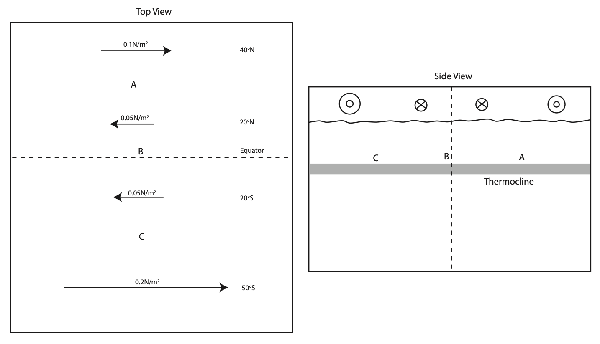

The figures below show the mean wind stress over the Pacific Ocean. The left figure shows a top view, and the right figure a side view.

a) Mark the Ekman transport with arrows in figure above.  

b) Would water be moving vertically upwards or downwards at A (at 30N), B (at the Equator) and C (at 35S)?

c) Assuming an Ekman layer depth of 20m calculate the Ekman layer velocity at 20N and 20S.  

d) Calculate the vertical water velocity (Ekman pumping) at A and C. Why can’t we calculate it in the same way at B?

e) Draw on the righthand panel in the figure above what you would expect the thermocline to look like. What are the biological implications of this?

f) Assume that the Pacific is 10,000km wide. What is the volume transport leaving the tropical Pacific in the Ekman Layer (at 20S and 20N)? Use this to estimate the average vertical velocity in the tropical region (in m/s and m/year; assume 1o latitude= 111km).

g) Upwelling can also be generated through winds parallel to a coast. Where must the coast be relative to the wind in the Northern and Southern Hemispheres? What wind direction causes upwelling in Los Angeles/USA and Perth/Australia?

