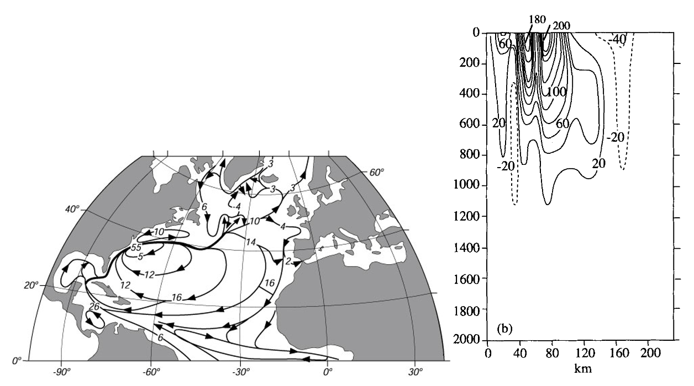

In the Figure below, the Gulf Stream is shown as a strong current flowing from Florida along the coast of North America, leaving it at around 38oN and subsequently moving towards the east. The right-hand panel shows a meridional cross-section of the Gulf Stream at around 38oN, 68oW. 

a. Estimate (using the data in the right hand panel above, contours in cm/s) the characteristic length scales for the width and depth of the Gulf Stream. In addition, make an estimate of the characteristic velocity in the x-direction. 

The characteristic velocities in the direction perpendicular to the current are approximately 10 times smaller than the velocities in the direction of the current. Similarly, the characteristic length scale in the direction of the current is approximately 10 times larger than the scale perpendicular to the current. Furthermore, assume that the Gulf Stream is stationary and use as horizontal and vertical eddy viscosity KH = 103 m2s−1 and KV = 0.1 m2s−1 respectively. 

b. Estimate the order of magnitude of the terms in the y-direction (perpendicular to the current) of the steady-state equation of motion. 
∂v/∂t+u ∂v/∂x+v ∂v/∂y+w ∂v/∂z+fu=-1/ρ  ∂p/∂y+∂/∂x (K_H  ∂v/∂x)+∂/∂y (K_H  ∂v/∂y)+∂/∂z (K_V  ∂v/∂z)
Which forces balance each other in the dominant balance? What is this balance called?

c. Repeat question b) for the momentum balance in the zonal direction

d. Calculate the magnitude of the total Rossby number (i.e. the Rossby number for the zonal, meridional and vertical direction combined) and that of the horizontal Ekman number in the x-direction. Give a physical interpretation of these numbers.

