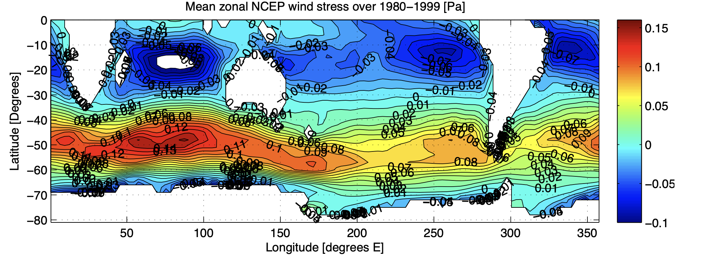

See the following zonal mean wind stress _τx_ and answer the following questions

a. By estimating the wind stress at different locations, calculate the depth-averaged Ekman layer velocities at the following locations: i) (15S, 250E) and ii) (50S, 100E). For these calculations, you may assume that _KV_ = 0.1 m2 s-1 and _ρ_ = 1000 kg m-3, but you should calculate _f_ yourself. 

b. Calculate the vertical Ekman pumping velocity in the following regions: i) (10-20S, 250E) and ii) (45-50S, 100E). You may assume that there is no gradient in the _y_-component of the wind-stress.

c. Would you expect a biological response in any of these regions? If so, how?
