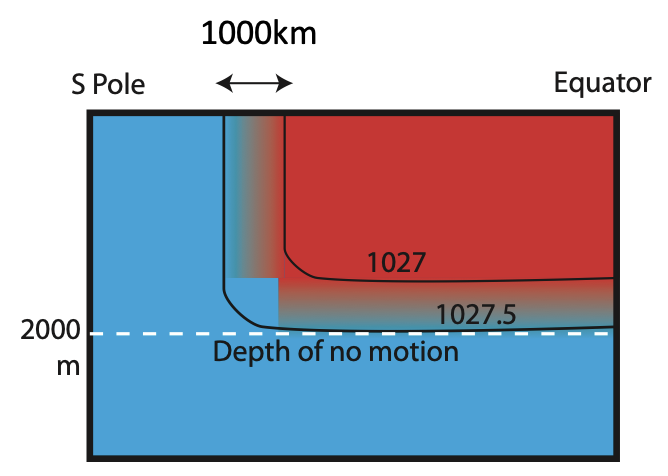

Using the thermal wind equations and given a depth of no motion is at -2000m (i.e. u = v = 0 at -2000m) calculate the strength and direction of the surface water between the two contours shown (at around 45oS) 

