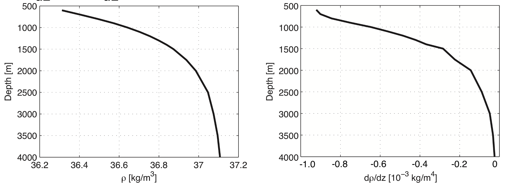

In this exercise, you will try and give an estimate for the global mean value of the vertical diffusivity coefficient _KV_ and for the energy required to keep the abyssal ocean mixed.

a. On average, approximately 40 Sv of Deep Water is formed in the ocean. Calculate, using this 40 Sv of downward transport, what globally averaged vertical upward velocity is needed to return the Deep Water to the surface. Assume that the radius of the earth is 6,400 km and that 70% of the earth surface is covered with water.

To a first order approximation, the advective-diffusive balance holds in the ocean interior. In this balance, the ocean-averaged downward motion is balanced by upward diffusion:

_w dρ/dz = KV d2ρ/dz2_

b. The figure above gives profiles of _ρ_ and _dρ/dz_ (note that the latter one is in 10-3 kg m-4). Using these profiles, get an order of magnitude estimate of _KV_ in the ocean between -4,000 m and -1,000 m (hint: use the assumption that the ocean averaged downward velocity equals the ocean averaged upward velocity). 

The power required to move water upward against gravity and the stratification is _E = w g Δρ A Δz_, where _A_ is the surface area of the ocean.

c. Estimate the total amount of power needed to maintain the deep upwelling of water in the thermohaline circulation between -4,000 m and -1,000 m. 

d. Imagine you have a 300W kitchen mixer. How large is the area (in m2) of the ocean that you could mix with that?